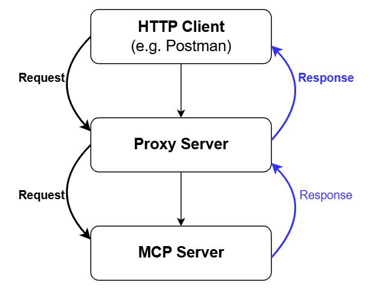

# Keepit MSP MCP

## About
This repository is maintained as an independent fork intended to help MSPs get started with an MSP-oriented Keepit MCP. It is not documented here as an official Keepit support channel, and this fork does not promise ongoing maintenance or response SLAs.

Keepit MSP MCP is Keepit's Model Context Protocol (MCP) server for use with Claude Desktop or other applications that support
local stdio-based MCP servers. Keepit MSP MCP's tools help you monitor, manage, and secure your Keepit estate using AI. 

Keepit MSP MCP provides integration with **Keepit** for backup and data protection services

Keepit MSP MCP allows you to use natural language — [Claude Desktop](https://support.anthropic.com/en/articles/10065433-installing-claude-for-desktop) or any MCP client — to interact with your Keepit account through the Keepit REST API.

Example queries:
- `Do I have any unhealthy connectors?`
- `Show me failed audit logs with duration PT6H`
- `Get all users in my tenant` (with Lokka integration)

To get a sense of what's possible with Keepit MSP MCP, we've provided a comprehensive set of example prompts in [PROMPTS.md](PROMPTS.md).

For contributor-facing codebase documentation, see [docs/DEVELOPER_GUIDE.md](docs/DEVELOPER_GUIDE.md).

## Fork Status

This codebase is documented here as an independent fork focused on MSP use cases and onboarding. It is provided to help MSP operators get started with an MSP MCP implementation.

Current expectations documented for this fork:

- The fork is intended as a starting point for MSP workflows rather than a guaranteed long-term supported product.
- Keepit may choose to adopt ideas or functionality from it, but that is not guaranteed by this repository.
- Issue review and fixes may happen on a best-effort basis, but this README does not promise ongoing support or maintenance timelines.

## What is MCP?

The Model Context Protocol (MCP) is a standardized way for AI assistants like Claude to interact with external tools and data sources. MCP servers act as bridges between an LLM and external services, allowing the LLM to:

- Retrieve data from external systems
- Execute commands on those systems
- Present the results back to the user

Claude Desktop can connect to multiple MCP servers simultaneously, each providing access to different services. Microsoft has added support for MCP to VSCode and Copilot Studio and is adding MCP tools as first-class apps in an upcoming release of Windows 11. Many other tools can consume MCP servers as well.

## Safety and security
Keepit MCP runs as a local MCP server on your local machine. It does not expose filesystem or shell tools through MCP, so the LLM cannot read local files or execute local commands through this server alone. However,
depending on what other MCP servers you have configured, the LLM you use may have access to local or remote files (including through Google Drive or OneDrive),
the ability to send mail, and other capabilities. We have put guardrails in place (strict type safety, input and schema validation, etc.), but the ultimate protection
for your Keepit account is to safeguard the API token you use for running Keepit MCP, including making sure that it has the least privilege necessary to run the tools you
want to use.

For transparency: development tooling and standalone logging may write a local `keepit-msp-mcp.log` file outside stdio-MCP mode, and the optional HTTP proxy is intended for local development only.

You should also note that it is possible that the LLM you use may take actions you didn't explicitly command. Be careful when testing prompts to ensure that an over-eager LLM construction won't result in an action that damages important data. 

## Architecture
Keepit MCP is written as a collection of [MCP tools](https://modelcontextprotocol.io/docs/concepts/tools). There are tools for
connectors, audit logs, jobs, snapshots, and so on. This approach was chosen to make implementation easier. It's a little clunky for the end user because they must consent to every individual tool – it might be worth refactoring to combine multiple tool handlers into one. However, the big advantage of this approach is that MCP tools are composable, so users can easily create prompts/queries that take results from different tools (and thus from different services). 

An example: "We had an outage yesterday. For all connectors:
1. Show health status now
2. Show job history for P2D - any spike in failures?
3. Show audit logs for P2D - any config changes or unusual admin activity?
4. Cross-reference: which connectors had both failed jobs AND audit events within the same 2-hour window?"

Each tool contains the logic required to request a specific item type and return it in a format that the LLM can consume.
The tool definitions specify the input schema for each individual tool, and the tool handler (which actually does the work for the tool) may return
structured results or simple items like a string or GUID.

## Installation
To use the **Keepit MSP MCP server** for either production or development, you need to install the repository on your local machine.  

Follow the steps below to set up the project environment:
1. **Install the required software (if not already installed):**
    - [Git](https://git-scm.com/downloads)
    - [Node.js](https://nodejs.org/en/download) — version `≥ 22.10.0`
    - Recommended:
        - [nvm](https://github.com/nvm-sh/nvm?tab=readme-ov-file#intro) for easy Node.js version management
        - [npm](https://www.npmjs.com/get-npm) — check your version (should be `≥ 10.9.2`):
       ```bash
       npm -v

2. **Clone the repository:**
   ```bash
   git clone https://github.com/acgdickie/keepit-msp-mcp.git
   
3. After cloning the repository, open the project folder:
    ```bash
    cd keepit-msp-mcp

4. Install dependencies using the command:
     ```bash
     npm install 

## Usage
This project can be used for:

1. Сreating MCPB package
2. Installing MCPB package into Claude
3. Run Keepit MSP MCP server with MCP clients that support `stdio` transport
4. Developing the Keepit MSP MCP server

**Note:** Before proceeding, make sure the project is properly installed (see the [Installation](#installation) section).

### Create MCPB package
- Open the project folder:
  ```bash
  cd keepit-msp-mcp

- Run the build command:
  ```bash
  npm run generate-mcpb

- After a successful build, the `keepit-msp-mcp.mcpb` file will be generated.

### Installing MCPB package into Claude
- Download and install the desktop version of Claude [Claude Desktop Download](https://claude.ai/download) (if not already installed)
- In the Claude app, go to: `Settings > Extensions > Advanced settings`
- Click `Install Extension...`
- In the popup, select the previously generated MCPB package (`keepit-msp-mcp.mcpb`) and click Install.
- Upon installation, you will be prompted with a popup requiring your Keepit account credentials: login, password, and the region where your account is hosted.
    - **Note:**  We highly recommend using a secondary token (instead of your main login/password) for authentication. You can create one in the Keepit Web App: (`User info page > Security tab > Secondary tokens`)
- Enable the newly installed extension.

### Run the Keepit MSP MCP Server in Production Mode: 
  - We highly recommend that you read our [security recommendations](./SECURITY.md).

### Support Expectations
- This fork is shared as a practical MSP starter implementation.
- No ongoing support commitment or response SLA is promised by this repository.
- If you use it in production, review the code, validate behavior in your own environment, and decide what internal support/ownership model you need around it.

### Healthcheck
- Run the startup validation and auth self-check:
  ```bash
  npm run healthcheck
  ```
- This verifies `KEEPIT_USER`, `KEEPIT_PASS`, `KEEPIT_ENV`, and confirms the server can resolve the authenticated user and role.

### Smoke Tests
- Run the deterministic repo smoke suite:
  ```bash
  npm run smoke:ci
  ```
- Run the optional live-tenant smoke suite against the real account in your local `.env`:
  ```bash
  npm run smoke:live
  ```
- `smoke:ci` builds the repo before running the smoke checks.
- `smoke:live` also accepts `KEEPIT_USER`, `KEEPIT_PASS`, and `KEEPIT_ENV` from the current process environment. If they are already exported, a local `.env` file is not required.
- `smoke:live` is intentionally broader than CI. It exercises real account, connector, job, audit, snapshot, and MSP flows and may skip tenant-specific checks when no client account or connector is discoverable.
- Optional override: set `SMOKE_CONNECTOR_GUID` when you want the live smoke to target a specific connector.

### Review / Release Verification
- Run the full local verification path with:
  ```bash
  npm run release:check
  ```
- The current implementation runs build, manifest sync, lint, unit tests, CI smoke tests, and MCPB packaging in sequence.

### Developing the Keepit MSP MCP server

Alongside the Keepit MSP MCP server, we have a dedicated **Proxy server**. This server acts as a wrapper around the MCP and allows us to **test new or existing MCP tools locally** without the need to repeatedly create MCPB packages.

The Proxy server is an **HTTP server** that listens for incoming requests (e.g., from Postman) and forwards them to the MCP server.  
Responses from the MCP server are then sent back through the Proxy to the HTTP client.

This setup is always available during development and enables us to **debug and test everything locally in real-time**, making development and troubleshooting much faster and more convenient.




#### Run the Keepit MSP MCP server locally in development mode:
  - In the project root, create an `.env` file to store your configuration:
    ```bash
    nano .env or vim .env

  - Inside the created `.env` file, add the following environment variables (values shown as examples):
    ```bash
    KEEPIT_USER=OgGvCVqJDkPVql=?75AXDIBM
    KEEPIT_PASS=55Z,oS0yn8n.esNdrjvZgfEE
    KEEPIT_ENV=ws-test
    KEEPIT_DISABLE_ANALYTICS=0
    LOCAL_PORT=5000
    ```
    - **Note:**  The LOCAL_PORT field is optional. If not specified, the server will run on http://127.0.0.1:3000
    - **Note:** `KEEPIT_DISABLE_ANALYTICS` is optional. Telemetry is enabled by default for direct/local runs. Set it to `1`, `true`, or `yes` to disable it.
    - **Note:** Packaged installs also expose a telemetry toggle in extension settings.
   
  - Run the following command to start the development server:
    ```bash
    npm start

#### Test the Keepit MSP MCP server locally in development mode, using any API client to send requests:
  - Open the API client.
  - Use the following request params:
    ```bash
    Request type: POST
    Request URL: http://localhost:3000/ (or port which you set in .env file)
    Body: raw/JSON
    Textfield:
       {
          "requestName": "TOOL_NAME"
       }
  
       OR
    
       {
            "requestName": "TOOL_NAME",
            "argumentsList": {
                "ARGUMENT_NAME": "ARGUMENT_VALUE"
            }
        }
    ```
    For example:
    ```bash
    {
        "requestName": "get_active_jobs",
        "argumentsList": {
            "guid": "etabjx-opdiwv-lkxb6e"
        }
    }
    ```

#### Testing with Postman's Native MCP Support

Postman provides native support for MCP servers, allowing you to test the Keepit MCP server directly within Postman. This approach is simpler than using the HTTP Proxy server for testing.

**Steps to test:**

1. **Start the Keepit MSP MCP server:**
   ```bash
   npm start
   ```

2. **Open Postman and create an MCP request:**
   - Open Postman and navigate to your workspace
   - Click on the `New` button to create a new request
   - Select request type: **MCP Request** (instead of HTTP)

3. **Configure the MCP server connection:**
   - In the MCP request panel, configure the server settings:
     - **Server type**: stdio
     - **Command**: `node` (or your Node.js path)
     - **Arguments**: `<path-to-keepit-msp-mcp>/build/main.js`
     - **Environment variables**: Add your environment variables (KEEPIT_USER, KEEPIT_PASS, KEEPIT_ENV)

4. **Send MCP tool requests:**
   - Once connected, Postman will discover and display all available MCP tools from the Keepit MCP server
   - Select a tool from the list and configure its parameters
   - Send the request to test the tool's functionality

For more detailed information about Postman's MCP support, see [Postman's MCP documentation](https://learning.postman.com/docs/postman-ai/mcp-requests/overview/).

#### Testing with MCP Inspector

The MCP Inspector is a built-in debugging tool that allows you to test and inspect MCP servers directly from the command line. It provides a web-based UI to interact with your MCP server and inspect all available tools and their responses.

**Steps to test:**

1. **Ensure your MCP server is built:**
   ```bash
   npm run build
   ```

2. **Run MCP Inspector with your Keepit MSP MCP server:**
   ```bash
   npx @modelcontextprotocol/inspector build/main.js
   ```

3. **Access the inspector UI:**
   - The command will output a local URL (typically `http://localhost:5173`)
   - Open this URL in your web browser
   - The inspector will display all available tools from the Keepit MCP server

For more information about MCP Inspector, see the [official MCP documentation](https://modelcontextprotocol.io/docs/tools/inspector).

## Operational Notes

- `KEEPIT_DISABLE_ANALYTICS` is optional and defaults to telemetry enabled for direct/local runs. Set `KEEPIT_DISABLE_ANALYTICS=1` to opt out.
- Packaged installs expose the same preference through extension settings.
- `npm test` runs the unit suite through the same `test:unit` path used by CI-friendly local verification.
- `npm audit --omit=dev` is the recommended runtime dependency check. The remaining `npm audit` warnings currently come from dev-only packaging/tooling dependencies and are not part of the shipped production dependency set.
- For `get_audit_log_history`, each request returns at most `500` records, and `limit` defaults to `500`.
- For single-account audit queries, when more audit history is available the response returns `pagination.nextOffset`. Repeat the same query with that `offset` to continue with the next window.
- Broad multi-account audit queries do not support continuation. If a broad query is capped or truncated, narrow the query to one account to retrieve additional records reliably.
- When a response is capped, the tool also returns an explicit message explaining whether the next step is `offset` continuation or narrowing the query scope.
- The server retries transient failures for safe `GET`/`HEAD` requests and for explicitly marked safe read-only `PUT` queries, with short backoff, and still uses a request timeout to avoid hanging indefinitely.
- The local dev proxy exposes `GET /health` on `127.0.0.1` and reports whether the proxied MCP child has completed initialization.

## Tool Development

This section describes how tools are implemented in Keepit MCP, providing a pattern for developers to follow when creating new tools.

### Architecture Overview

Keepit MSP MCP uses a modular, composable tool architecture with three distinct layers for each tool category:

```
┌─────────────────────────────────────────┐
│  Tool Definitions & Schemas             │
│  - Defines tool name, description       │
│  - Specifies input/output schemas (JSON)│
│  - Declares required ACL permissions    │
└────────────────────┬────────────────────┘
                     │
┌────────────────────▼────────────────────┐
│  Tool Handlers (Business Logic)         │
│  - Implements tool execution            │
│  - Validates inputs & handles errors    │
│  - Calls helper functions               │
└────────────────────┬────────────────────┘
                     │
┌────────────────────▼────────────────────┐
│  Tool Helpers (API & Data Logic)        │
│  - Makes API requests                   │
│  - Transforms data                      │
│  - Returns structured results           │
└─────────────────────────────────────────┘
```

### File Structure

Most tool categories follow a standard three-file layout:

```
src/tools/
├── [category]/
│   ├── [category]-tools-definitions.ts      # Tool schemas & metadata
│   ├── [category]-tools-handler.ts          # Tool execution logic
│   └── [category]-tools.helper.ts           # API & business logic
├── index.ts                                  # Tool aggregation & export
└── tools.interfaces.ts                       # Shared TypeScript types
```

The account tool area uses an expanded layout to manage a larger surface area:

```
src/tools/account/
├── account-tools-definitions.ts             # Tool schemas & ACL declarations
├── account-tools-handler.ts                 # MCP handler wrappers
├── account-tools.helper.ts                  # Re-export barrel (backward-compatible entry point)
├── account-tools-utils.ts                   # Shared types and utility functions
├── account-tools-nav.helper.ts              # Auth bootstrap and account navigation
├── account-tools-single.helper.ts           # Single-account tool logic
├── account-tools-msp.helper.ts              # MSP fan-out aggregation logic
└── account-context.helper.ts               # Scope traversal, caching, concurrency
```

## Legal Disclaimer for Keepit MCP Server
This software ("Keepit MCP") is provided "as is" without warranty of any kind, express or implied, including but not limited to the warranties of merchantability, fitness for a particular purpose, and non-infringement. In no event shall Keepit A/S or the authors be liable for any claim, damages, or other liability, whether in an action of contract, tort, or otherwise, arising from, out of, or in connection with the software or the use or other dealings in the software.

## Limitation of Liability
To the maximum extent permitted by law, Keepit A/S and its affiliates shall not be liable for any direct, indirect, incidental, special, consequential, or punitive damages, loss of data, revenue, profits, or business opportunities, system downtime, security breaches, or unauthorized access, costs of procurement of substitute services or technology, and damages arising from reliance on AI-generated recommendations or actions.

## Indemnification
Users agree to indemnify and hold harmless Keepit and its affiliates from any claims, damages, losses, or expenses arising from use or misuse of the Keepit MCP server, violation of third-party terms of service or acceptable use policies, non-compliance with applicable laws or regulations, unauthorized access, or security incidents related to user credentials.

## Service Availability and Performance
Keepit makes no guarantees regarding availability, performance, or reliability of the Keepit MCP server, compatibility with future versions of Claude Desktop, MCP protocol, or integrated APIs, continued support, updates, or maintenance of this software, response times, error handling, or system stability.

## API Integration and Data Security
Third-Party API Dependencies: Keepit MCP integrates with external APIs, including Keepit and Microsoft services. Users are responsible for complying with all applicable API terms of service and acceptable use policies, managing their own API credentials, tokens, and access permissions securely, ensuring proper security practices when handling API keys and authentication tokens, monitoring their usage and associated costs across all integrated services.

## Data Flow and Privacy
Users acknowledge that:

- All prompts, API responses, and data transmitted through this software may be processed by third-party AI services and their associated data processors via servers that may be located in various jurisdictions, including but not limited to the United States.
- Backup data, credentials, and operational commands flow through multiple systems.
- Data may be transmitted across different geographic regions and cloud providers.
- Users are responsible for ensuring compliance with applicable data protection regulations (GDPR, CCPA, etc.).

## AI-Powered Operations and Risk Management
This software uses AI interpretation to execute commands against production backup and restore systems. Users assume all responsibility for actions taken by the AI system, including unintended or over-eager responses, data restoration, deletion, or modification operations initiated through natural language commands, verification of AI-interpreted commands before execution, particularly for any potentially destructive operations, implementing appropriate safeguards, testing procedures, and understand rollback capabilities if any.

## Updates and Modifications
This disclaimer may be updated at any time without notice. Continued use of the software constitutes acceptance of any modifications to these terms.
